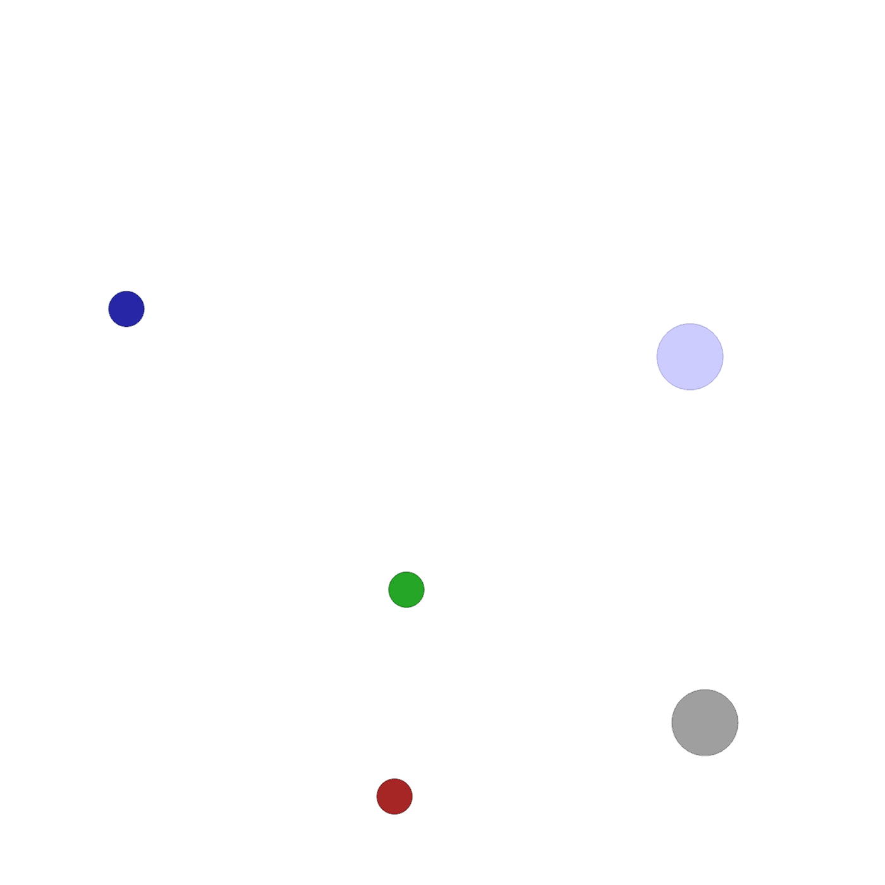
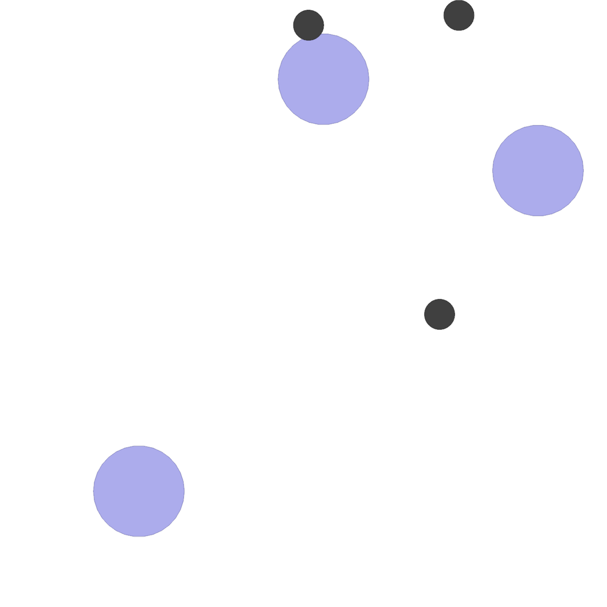
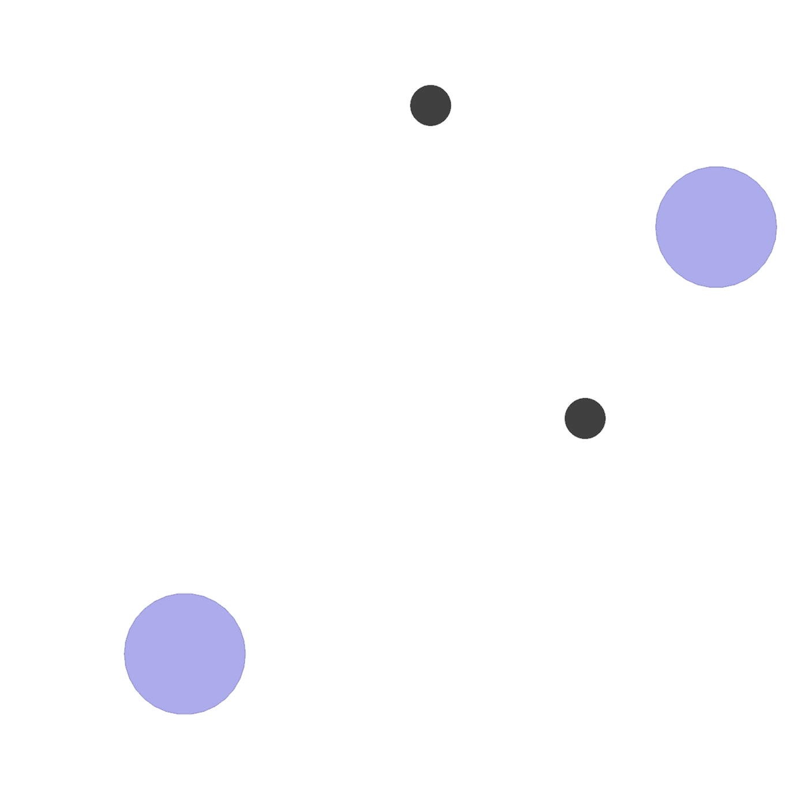
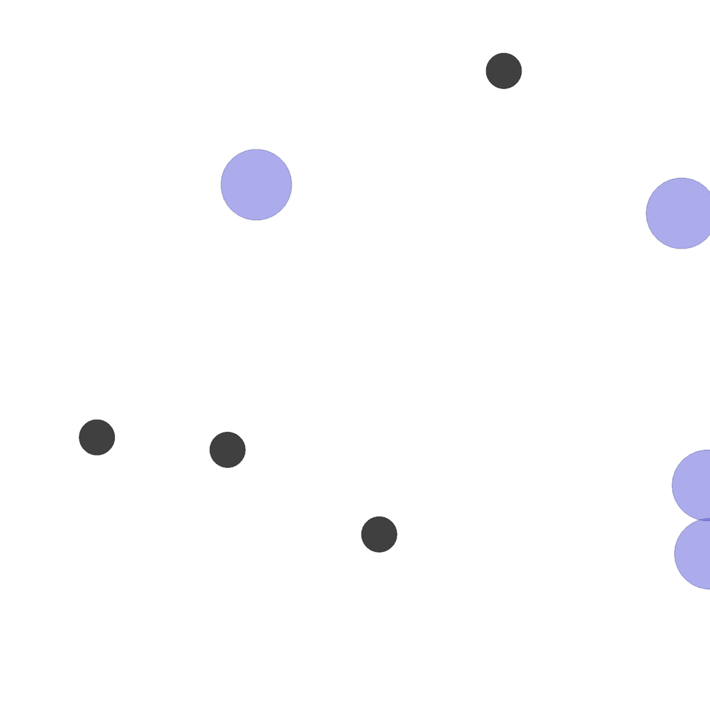

# Value-Aware Prediction for Robust Multi-Agent Coordination Under Communication Loss

This repository is maintained anonymously for review purposes.
GitHub contributor attribution may reflect hosting account activity rather than authorship.

## Overview

This codebase implements **MARO (Multi-Agent Response Observation)**, a hybrid perception module for multi-agent reinforcement learning that enables centralized training via learned inter-agent communication with configurable dropout. MARO can be combined with any standard MARL algorithm.

The algorithms are derived from [hybrid-marl](https://github.com/PPSantos/hybrid-marl), which extends the [EPyMARL](https://github.com/uoe-agents/epymarl) library.

## Visualizations

Episode rollouts (communication probability 1.0) for selected MPE environments:

| Environment | Demo |
|-------------|------|
| SimpleBlindDeaf (HearSee) |  |
| SimpleSpeakerListener |  |
| SimpleSpreadBlind (SpreadBlindfold) |  |
| SimpleSpreadXY (SpreadXY-2) |  |
| SimpleSpreadXY4 (SpreadXY-4) |  |

## Dependencies

- Python 3.8.x (original experiments were run with 3.8.10)
- MPE (`multiagent-particle-envs`)

Note: This repo includes a copy of MPE under `multiagent-particle-envs/`.

## Installation

```bash
./install.sh
```

## Running experiments

Use `run.sh` (or the manual command below). Key variables:

### Environments (MPE)

| `ENV` value | Environment |
|---|---|
| `SimpleSpreadXY-v0` | SpreadXY-2 |
| `SimpleSpreadXY4-v0` | SpreadXY-4 |
| `SimpleSpreadBlind-v0` | SpreadBlindfold |
| `SimpleBlindDeaf-v0` | HearSee |
| `SimpleSpeakerListener-v0` | SimpleSpeakerListener |

### Algorithms

| `ALGO` value | Description |
|---|---|
| `ippo` | IPPO |
| `ippo_ns` | IPPO (NS variant) |
| `mappo` | MAPPO |
| `mappo_ns` | MAPPO (NS variant) |

### Perception (MARO) and `adv_lambda`

Our comparison is controlled by a single hyperparameter in `src/config/perception.yaml`:

- **Value-Aware MARO**: `adv_lambda: 1.0`
- **MARO baseline**: `adv_lambda: 0.0`

You can switch it either by editing `src/config/perception.yaml` (one line) or by overriding from the command line with `with perception_args.adv_lambda=...`.

### Time limit

- `TIME_LIMIT=25` for the MPE environments above.

### Example (single run)

```bash
ENV="SimpleSpreadBlind-v0"
ALGO="mappo_ns"
PERCEPTION="maro"   # MARO config lives in src/config/custom_configs/maro.yaml
TIME_LIMIT=25
ADV_LAMBDA=1.0       # 1.0 = Value-Aware MARO, 0.0 = MARO baseline

cp "src/config/custom_configs/${PERCEPTION}.yaml" src/config/perception.yaml

python3 src/main.py --config="$ALGO" --env-config=gymma \
    with env_args.key="$ENV" env_args.time_limit=$TIME_LIMIT seed=0 perception_args.adv_lambda=$ADV_LAMBDA
```

Outputs are written under `results/` (Sacred runs under `results/sacred/` and CSV logs under `results/logs/`).

## References

- [EPyMARL](https://github.com/uoe-agents/epymarl) — Extended PyMARL framework
- [hybrid-marl](https://github.com/PPSantos/hybrid-marl) — Base algorithm implementations
- [OpenAI MPE](https://github.com/openai/multiagent-particle-envs) — Multi-agent particle environments
- [LBF](https://github.com/semitable/lb-foraging) — Level-based foraging environment
   